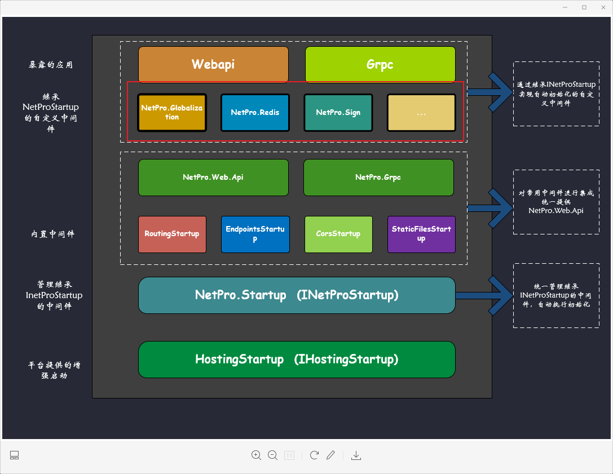
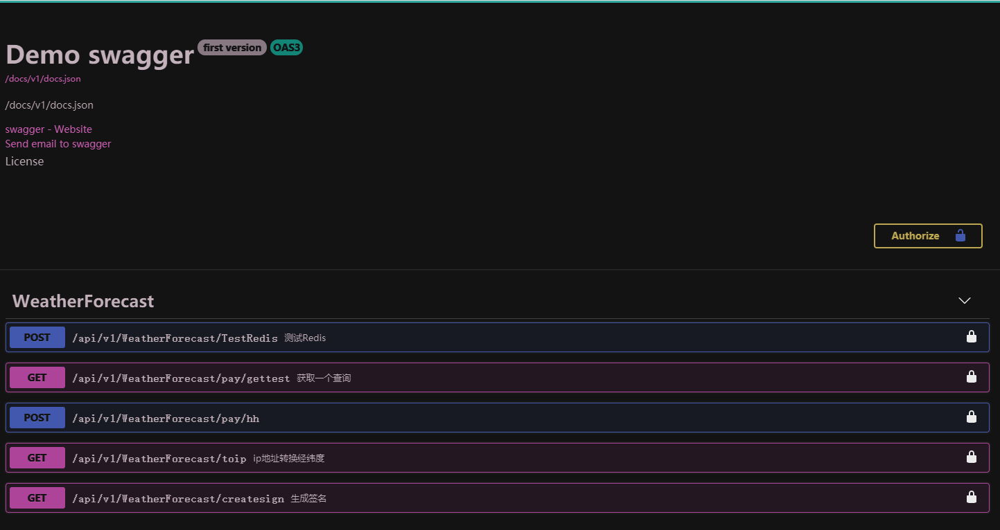
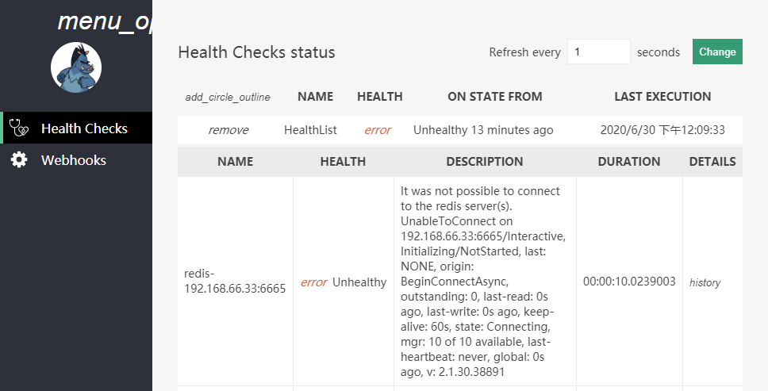
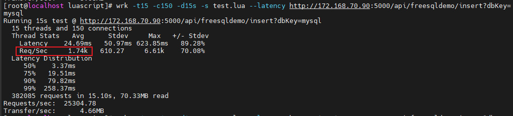

<p align="center">
  
</p>

# NetPro [Pages](https://leonkou.github.io/NetPro/)
 


### 🕰️ 活跃分支

* 👉[*dev_6.0* branch](https://github.com/LeonKou/NetPro/tree/dev_6.0)

## 简要

.NetpPro是一组独立中间件的类库统称，具有轻量级，依赖小，易用使用且高效。

在以往的开发中我们常常封装内置一堆组件作为框架进行使用，项目是否使用这些组件功能都将统统加载，组件无法插拔，往往都是集成度和依赖较高，导致新的学习成本，对于长期维护埋下了很大隐患；而不做封装又要面对杂乱的注入顺序和繁琐重复的的初始化逻辑，有没有办法既可以按需引用又可以避免这些初始化逻辑并且都能以各组件原生的方式调用，
NetPro就是为解决以上问题而创建。


所有组件在[/src/Library](https://github.com/LeonKou/NetPro/tree/dev_6.0/src/Library)路径下，每个组件已有详尽的使用说明文档README.md

组件可在任意项目中使用，不强依赖NetPro环境，支持按需引用，引用即自动初始化，免去各类中间件繁琐初始化操作，支持`net3.1` `net6.0`。NetPro项目在基于核心包`NetPro.Startup`基础上提供了其他周边常用中间件，其核心封装逻辑也是尽可能的暴露原生方法，不对开发人员产生过多不必要的学习成本。
基于`NetPro.Startup`的有两个关键插件包：
- `NetPro.Web.Api` 用于开发webapi项目
- `NetPro.Grpc` 用于开发grpc项目

其他的所有[NetPro](https://github.com/LeonKou/NetPro/tree/dev_6.0/src/Library)中间件都是可插拔，按需引用，每个组件都相对轻量，没有强关联NetPro，即使非.NetPro框架也可使用。如果基于`NetPro.Web.Api`或 `NetPro.Grpc`引用的NetPro中间件，支持引用即`自动执行`初始化逻辑。


### 架构图

<p align="center">
  
</p>


#### 提供的中间件包含不限于以下：

`FreeSql`,`Autofac` , `Automapper`,`apollo`,`App.Metrics`,

`CsRedisCore`,`StackExchange.Redis`,`Serilog`,

`MiniProfiler`,`FluentValidation`,`IdGen`,

`MongoDb`,`Dapper`,`RedLock.Net`,

`Sentry`,`RabbitMQ.Client`,`SkyAPM`,

`Swagger`,`WebApiClient.Core`,

`TimeZoneConverter`,`healthcheck`

`exceptionless`


### 使用
##### 各组件已发布Nuget包，可单独使用，如需插件化和自动执行初始化请使用`NetPro.Web.Api`或者`NetPro.Grpc`

##### 支持的组件

- [](https://nuget.org/packages/NetPro.Web.Api) [NetPro.Web.Api](https://github.com/LeonKou/NetPro.Web.Api) （NetPro.Web.Api）

- [](https://nuget.org/packages/NetPro.MQTTClient) [NetPro.MQTTClient](https://github.com/LeonKou/NetPro.MQTTClient) （物联网MQTTClient客户端）

- [](https://nuget.org/packages/NetPro.Globalization) [NetPro.Globalization](https://github.com/LeonKou/NetPro.Globalization) （多语言全球化）

- [](https://nuget.org/packages/NetPro.Cors) [NetPro.Cors](https://github.com/LeonKou/NetPro.Cors) （NetPro.Cors 跨域配置）

- [](https://nuget.org/packages/NetPro.ConsulClient) [NetPro.ConsulClient](https://github.com/LeonKou/NetPro.ConsulClient) （NetPro.ConsulClient 服务注册发现组件，只需引用即可无需额外操作）


- [](https://nuget.org/packages/NetPro.TypeFinder) [NetPro.TypeFinder](https://github.com/LeonKou/NetPro.TypeFinder) （dll检索，反射）

- [](https://nuget.org/packages/NetPro.Utility) [NetPro.Utility](https://github.com/LeonKou/NetPro.Utility) （包含常用帮助类）

- [](https://nuget.org/packages/NetPro.Authentication) [NetPro.Authentication](https://github.com/LeonKou/NetPro.Authentication) （认证相关）

- [](https://nuget.org/packages/NetPro.EasyNetQ) [NetPro.EasyNetQ](https://github.com/LeonKou/NetPro.EasyNetQ) （EasyNetQ，支持多server）

- [](https://nuget.org/packages/NetPro.Checker) [NetPro.Checker](https://github.com/LeonKou/NetPro.Checker) （组件健康检查）

- [](https://nuget.org/packages/NetPro.MongoDb ) [NetPro.MongoDb ](https://github.com/LeonKou/NetPro.MongoDb ) （mongodbi）

- [](https://nuget.org/packages/NetPro.CsRedis) [NetPro.CsRedis](https://github.com/LeonKou/NetPro.CsRedis) （redis推荐使用此组件；CsRedis分布式锁）

- [](https://nuget.org/packages/NetPro.RedisManager ) [NetPro.RedisManager ](https://github.com/LeonKou/NetPro.RedisManager ) （Redis组件，包含CsRedis，StackExchangeRedis，分布式锁）

- [](https://nuget.org/packages/NetPro.Swagger ) [NetPro.Swagger ](https://github.com/LeonKou/NetPro.Swagger ) （Swagger，包含认证，文件上传，公共参，个性主题）

- [](https://nuget.org/packages/NetPro.Sign ) [NetPro.Sign ](https://github.com/LeonKou/NetPro.Sign ) （签名）

- [](https://nuget.org/packages/NetPro.ResponseCache ) [NetPro.ResponseCache ](https://github.com/LeonKou/NetPro.ResponseCache ) （响应缓存）

- [](https://nuget.org/packages/NetPro.AutoMapper ) [NetPro.AutoMapper ](https://github.com/LeonKou/NetPro.AutoMapper ) （对象映射）

- [](https://nuget.org/packages/NetPro.Analysic) [NetPro.Analysic](https://github.com/LeonKou/NetPro.Analysic)(请求分析控制，可精细配置同ip一定时间的错误数和正确数，超过阈值拦截熔断访问)

---

具体参考 NetPro\src\Template\API\Content（插模块插件)项目

 webapi项目引用 `NetPro.Web.Api` [](https://nuget.org/packages/NetPro.Web.Api)  引用最新nuget即可

Package Manager方式: `Install-Package NetPro.Web.Api -Version 3.1.2`

.NET CLI 方式: `dotnet add package NetPro.Web.Api --version 3.1.2`

PackageReference:`<PackageReference Include="NetPro.Web.Api" Version="3.1.2" />`

.NET CLI 方式: `paket add NetPro.Web.Api --version 3.1.2`

---

## 通过脚手架创建项目(推荐)

### 1、安装netproapi[](https://nuget.org/packages/netproapi)脚手架
执行以下命令安装脚手架
```
dotnet new -i netproapi::* 
```

### 2、使用脚手架创建项目

在指定的项目文件夹中执行以下命令
```
dotnet new netproapi -n 项目名称
```
例如当前项目为IAM
```
dotnet new netproapi -n IAM
```
执行以上命令将自动创建WebApi代码解决方案

## 手动创建项目

*  修改`Program.cs`

```csharp

Environment.SetEnvironmentVariable("ASPNETCORE_HOSTINGSTARTUPASSEMBLIES", "NetPro.Startup");

var host = Host.CreateDefaultBuilder(args)
                .ConfigureAppConfiguration((hostingContext, config) =>
                {
                    ApolloClientHelper.ApolloConfig(hostingContext, config, args);
                });

host.Build().Run();

```

* 增加 `EndpointsStartup.cs`文件配置
可加多个继承了INetProStartup接口的启动类来控制启动顺序和初始化
此文件继承`INetProStartup`接口，提供了microsoft原生依赖注入能力，所有组件注入放于此 ，Startup.cs将不接受组件注入

```csharp
// <auto-generated>
//  UseEndpoints   
// </auto-generated>

using Microsoft.AspNetCore.Builder;
using Microsoft.Extensions.Configuration;
using Microsoft.Extensions.DependencyInjection;

namespace NetPro.Web.Api
{
    /// <summary>
    /// Endpoints 
    /// </summary>
    public class EndpointsStartup : INetProStartup
    {
        /// <summary>
        /// 
        /// </summary>
        /// <param name="services"></param>
        /// <param name="configuration"></param>
        /// <param name="typeFinder"></param>
        public void ConfigureServices(IServiceCollection services, IConfiguration configuration, ITypeFinder typeFinder)
        {

        }

        /// <summary>
        /// Endpoints请求管道;
        /// Order执行顺序保证在RoutingStartup（200）之后即可
        /// </summary>
        /// <param name="application"></param>
        /// <param name="env"></param>
        public void Configure(IApplicationBuilder application, IWebHostEnvironment env)
        {
            application.UseEndpoints(s =>
            {
                //对于请求的配置都可在此处
                s.MapControllers()
                //.RequireAuthorization() //全局添加认证授权
                ;
            });
        }

        /// <summary>
        /// UseEndpoints can be executed after RoutingStartup
        /// </summary>
        public double Order { get; set; } = 1000;
    }
}

```

* 修改`appsettings.json` 文件

```json
{
	"TypeFinderOption": {
		"MountePath": ""//插件挂载路径，可默认
	}
}


```

* Controller使用

`Controller`继承原生`ControllerBase`即可，使用也参考官方原生接口开发

```csharp

	/// <summary>
	///
	/// </summary>
	[Route("api/v1/[controller]")]
	public class WeatherForecastController : ControllerBase
	{
		private readonly ILogger _logger;
		private IExampleProxy _userApi { get; set; }

		public WeatherForecastController(ILogger logger
			 ,IExampleProxy userApi)
		{
			_logger = logger;
			_userApi = userApi;
		}
	}
```
#### 约定


* `Service` 业务相关
* `Repository` 数据仓储相关(需要直接在Service或Controller中直接操作数据库可无需使用此后缀)
* `Proxy` 代理请求相关（请求远程接口使用）
* `Aggregate` 聚合相关，当Service 或者Controller 业务逻辑繁琐复杂可在此聚合后再调用

### 发布

###### 发布自包含应用

```
dotnet publish -r linux-x64 -c release /p:PublishSingleFile=true /p:PublishTrimmed=true
```
###### 依赖CLR运行时应用
```
dotnet publish -r linux-x64 -c release
```

### 运行

开发环境运行后效果如下：

```
 ____  _____        _   _______
|_   \|_   _|      / |_|_   __ \
  |   \ | |  .---.`| |-' | |__) |_ .--.   .--.
  | |\ \| | / /__\\| |   |  ___/[ `/'`\]/ .'`\ \
 _| |_\   |_| \__.,| |, _| |_    | |    | \__. |
|_____|\____|'.__.'\__/|_____|  [___]    '.__.'


[17:40:03] dotnet process id:14520
The enhanced service has started
[17:40:04] loading json files
Service injection sequence：
[17:40:15] apollo已关闭
info: NetProSwaggerServiceExtensions[0]
      NetPro Swagger 已启用
--------------------------------------------------------------------------------------------------------------------------------------
|    Order   |       StartupClassName       |                   Path                   |             Assembly            |  Version  |
--------------------------------------------------------------------------------------------------------------------------------------
| 0          | NetProCoreStartup            | NetPro.Core.Startup.NetProCoreStartup    | NetPro.Core                     |  3.1.13.0 |
--------------------------------------------------------------------------------------------------------------------------------------
| 0          | CheckerStartup               | NetPro.Analysic.CheckerStartup           | NetPro.Checker                  |  3.1.13.0 |
--------------------------------------------------------------------------------------------------------------------------------------
| 0          | ErrorHandlerStartup(default) | NetPro.Web.Api.ErrorHandlerStartup       | NetPro.Web.Api                  |  3.1.13.0 |
--------------------------------------------------------------------------------------------------------------------------------------
| 100        | SwaggerStartup               | NetPro.Swagger.SwaggerStartup            | NetPro.Swagger                  |  3.1.13.0 |
--------------------------------------------------------------------------------------------------------------------------------------
| 100        | StaticFilesStartup(default)  | NetPro.Web.Api.StaticFilesStartup        | NetPro.Web.Api                  |  3.1.13.0 |
--------------------------------------------------------------------------------------------------------------------------------------
| 200        | RoutingStartup(default)      | NetPro.Web.Api.RoutingStartup            | NetPro.Web.Api                  |  3.1.13.0 |
--------------------------------------------------------------------------------------------------------------------------------------
| 300        | CorsStartup                  | NetPro.Web.Api.CorsStartup               | NetPro.Web.Api                  |  3.1.13.0 |
--------------------------------------------------------------------------------------------------------------------------------------
| 400        | ShareBodyStartup             | NetPro.ShareRequestBody.ShareBodyStartup | NetPro.NetProShareRequestBody   |  3.1.13.0 |
--------------------------------------------------------------------------------------------------------------------------------------
| 1000       | EndpointsStartup(default)    | NetPro.Web.Api.EndpointsStartup          | XXX.API (custom)                |  1.0.0.0  |
--------------------------------------------------------------------------------------------------------------------------------------
| 1000       | NetProCsRedisStartup         | NetPro.CsRedis.NetProCsRedisStartup      | NetPro.CsRedis                  |  3.1.13.0 |
--------------------------------------------------------------------------------------------------------------------------------------
| 2147483647 | ApiStartup                   | XXX.API.ApiStartup                       | XXX.API (custom)                |  1.0.0.0  |
--------------------------------------------------------------------------------------------------------------------------------------
| 2147483647 | ApiStartup-1                 | XXX.Plugin.Web.Demo.ApiStartup           | XXX.Plugin.Web.Demo (custom)    |  1.0.0.0  |
--------------------------------------------------------------------------------------------------------------------------------------
| 2147483647 | ApiStartup-2                 | XXX.Plugin.Web.Manager.ApiStartup        | XXX.Plugin.Web.Manager (custom) |  1.0.0.0  |

```
第一次初始化会自动在程序当前目录生成`StartupConfig/startup.json`文件可修改对应Order来覆盖各中间件默认执行顺序
```json
{
  "NetProCoreStartup": 0,
  "CheckerStartup": 0,
  "ErrorHandlerStartup": 0,
  "SwaggerStartup": 100,
  "StaticFilesStartup": 100,
  "RoutingStartup": 200,
  "CorsStartup": 300,
  "ShareBodyStartup": 400,
  "EndpointsStartup": 1000,
  "ApiStartup": 2147483647,
  "ApiStartup-1": 2147483647,
  "ApiStartup-2": 2147483647
}

```

### IConfiguration 配置

在asp.netcore默认的appsettings.json配置策略上增加了自定义目录配置，例如在appsettings.json中增加ConfigPath配置文件目录
```
 "ConfigPath": "configjson",//配置目录
```
即可在configjson目录下创建json文件会自动加入配置驱动中，并支持环境加载，例如有以下两份json配置文件
- checker.json
- checker.Development.json

在自动加载checker.json配置文件的同时，依据当前环境决定是否加载checker.Development.json，如当前环境为Development ，即自动加载checker.Development.json文件以覆盖checker.json的相同节点配置信息


### 插件方式开发

可将开发好的dll丢入TypeFinderOption:MountePath 配置的文件路径中，即可自动加载当前dll无需工程文件引用

Swagger地址：[/swagger/index.html](ip:port/docs/index.html)
<p align="center">
  
</p>

健康检查地址 [/health](health)

健康检查面板[/ui](healthdashboard)
<p align="center">
  
</p>

应用信息 [/info](/info)

环境信息 [/env](/env)

## 问题处理指南

### 1. 如何覆盖系统异常处理

```csharp
var mvcBuilder = services.AddControllers(config =>
   {
    config.Filters.Add(typeof(CustomerExceptionFilter),2);//自定义全局异常过滤器//100是order值，越大越靠后加载
});
```
 ...

 ## 性能指标


在6核16G内存15秒内执行maridb数据库插入，qps可达到25304，并且可根据场景调整内存和性能方面的平衡，这就是依赖最小化带来的好处，简单高效，依赖越小问题越清晰。
## 高级配置 

### CLR配置
[Runtime configuration options for garbage collection](https://docs.microsoft.com/zh-cn/dotnet/core/runtime-config/garbage-collector)
通过配置文件控制运行状态
runtimeconfig.template.json
```json
{
   {
      "configProperties": {
       "System.GC.Server": true,//站点专用配置,默认false
       "System.GC.HeapHardLimit": 83886080,堆上限，单位字节
       "System.GC.HeapHardLimitPercent": 5,//堆上限，单位百分比，建议与HeapHardLimit二选一
       "System.GC.LOHThreshold": 1048576,//大对象定义，单位字节
       "System.GC.Concurrent": true,//后台回收，默认true
       "System.Runtime.Serialization.EnableUnsafeBinaryFormatterSerialization": false,
       "System.Threading.ThreadPool.MinThreads": 200
      }
    }
  }
}
```

### CLR监控
[CLR 全局工具](https://docs.microsoft.com/zh-cn/dotnet/core/diagnostics/dotnet-counters)
常用clr命令行工具

- dotnet-counters [Performance monitoring](https://www.stefangeiger.ch/2020/05/07/dotnet-diagnostics-tools-counters.html)
- dotnet-monitor [configuration](dotnet-monitor)
- dotnet-gcdump
- dotnet-trace

dotnet-monitor 自带api服务，方便restful 调用，推荐使用此工具
安装:
dotnet tool install -g dotnet-monitor
配置: [dotnet-monitor configuration](https://github.com/dotnet/dotnet-monitor/blob/main/documentation/configuration.md)

使用 `dotnet monitor config show` 打印配置

覆盖配置：
windows：`C:\Users\username\.dotnet-monitor\settings.json`

```
{
    "Metrics": {
      "Endpoints": "http://localhost:5009",
      "MetricCount": 3      
    }
  }
```
启动:
dotnet monitor collect

注意：

通常dotnet monitor在容器中使用时利用边车模式运行，故需要配置共享volume，即通过IPC实现容器间共享内存通信来收集目标进程中诊断数据
[.NET 6's dotnet monitor](https://www.cnblogs.com/stulzq/archive/2021/12/06/15650277.html)

[github:dotnet-monitor-ui](https://github.com/SachiraChin/dotnet-monitor-ui)

[dotnet-monitor-ui](https://dotnet-monitor-ui.dev/)

## Target

- 可视化安装卸载组件

# ...

