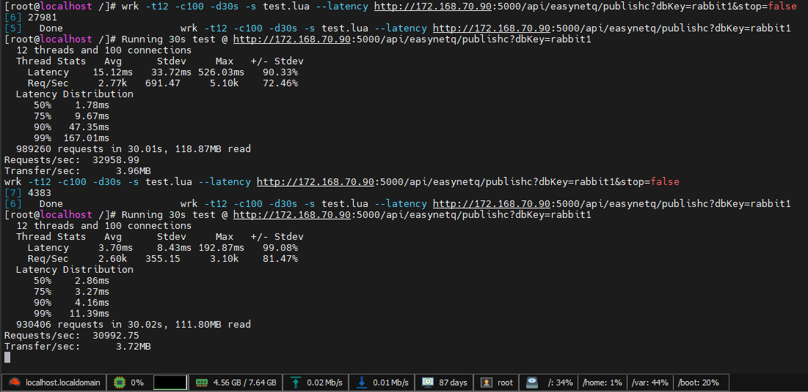

## EasyNetQ使用
 [](https://nuget.org/packages/NetPro.EasyNetQ)

对EasyNetQ的封装，简化使用，支持多库

### 使用

#### appsetting.json 

```json
"EasyNetQOption": {
    "Idle": 60,//默认60秒对象持续
    "ConnectionString": [
      {
        "Key": "rabbit2", //连接串key别名，唯一
        "Value": "host=192.168.18.129:5672;virtualHost=/;username=admin;password=123456;timeout=60" //别名key对应的连接串
      },
      {
        "Key": "rabbit1", //连接串key别名，唯一
        "Value": "host=192.168.18.129:5672;virtualHost=/;username=admin;password=123456;timeout=60" //别名key对应的连接串
      }
    ]
  },

```
#### 启用服务
没有基于NetPro.Web.Api 的使用场景，必须手动进行初始化，如下：
```csharp
IConfiguration Configuration;

public void ConfigureServices(IServiceCollection services,IConfiguration configuration)
{    
        services.AddEasyNetQ().Build(configuration);
}
```

基于NetPro.Web.Api的使用，只需要添加引用后配置以上appsetting.josn配置EasyNetQOption节点即可

### 使用说明

#### 发布者
```csharp
    /// <summary>
    /// rabbitmq发布者
    /// </summary>
 public class EasyNetQService : IRabbitmqService
    {
        private readonly IdleBus<IBus> _idbus;//适合用于发布者使用，内部有对象管理机制如用于订阅有连接断开可能的错误。
        private static bool _stop;
        public EasyNetQService(IdleBus<IBus> idbus)
        {
            _idbus = idbus;
        }


         public async Task PublishAsync(string dbKey = "rabbit1")
        {
            _idbus.Get(dbKey).PubSub.PublishAsync(new RabbitMessageModel { Text = $"[{DateTimeOffset.UtcNow.ToUnixTimeMilliseconds()}]this is a message" })
                  .ContinueWith(p =>
                  {
                      if (p.Exception != null)
                          p.Exception.Handle(x =>
                          {
                              Console.WriteLine(x.Message);
                              return true;
                          });
                  });
       }
    }
  /// <summary>
  /// 定义rabbitmq 的队列，交换机等
  /// </summary>
 [Queue("my_queue_name", ExchangeName = "my_exchange_name_")]
    public class RabbitMessageModel
    {
        /// <summary>
        /// 
        /// </summary>
        public string Text { get; set; }
    }
```
#### 消费者
```csharp
    /// <summary>
    /// rabbitmq消费者
    /// </summary>
    internal class RabbitMqStartTask : IStartupTask//消费者只需要初始化一次，放在后台服务或系统初始化操作中
    {
        private readonly IEasyNetQMulti _easyNetQMulti;//适合用于订阅者使用，无需using包裹保持对象不销毁以达到持续订阅。
       
        public RabbitMqStartTask()
        {
            _easyNetQMulti = EngineContext.Current.Resolve<IEasyNetQMulti>();
        }
        public int Order => 0;

        public void Execute()
        {
            //订阅/Subscribe
            //订阅需要保持长连接，请使用EasyNetQMulti获取连接对象并且不用使用using和调用dispose()
            var bus = _easyNetQMulti["rabbit1"];
            //同交换机，同队列下subscriptionId为订阅唯一标识，相同标识会依次收到订阅消息，类似于广播
            bus.PubSub.Subscribe<RabbitMessageModel>("subscriptionId_", tm =>
            {
                Console.WriteLine("Recieve Message: {0}", tm.Text);
            });
        }
    }
```

#### 性能：


#### 高级用法：
- 自定义方式获取连接串
```C#
public class XXXEasyNetQ : INetProStartup
{
    public double Order { get; set; } = int.MaxValue;

    public void ConfigureServices(IServiceCollection services, IConfiguration? configuration = null, ITypeFinder? typeFinder = null)
    {
        services.AddEasyNetQ(GetConnectionString);
    }

    public void Configure(IApplicationBuilder application, IWebHostEnvironment env)
    {
    }

    public IList<ConnectionString> GetConnectionString(IServiceProvider serviceProvider)
    {
        var connector = new List<ConnectionString>
        {
            new ConnectionString { Key = "2", Value = "host=192.168.100.187:5672;virtualHost=my_vhost;username=admin;password=admin;timeout=60" }
        };
        return connector;
    }
}
```
#### 更新中...
reference
 [使用rabbitmq消息队列——EasyNetQ插件介绍](https://www.cnblogs.com/shanfeng1000/p/12359190.html)

